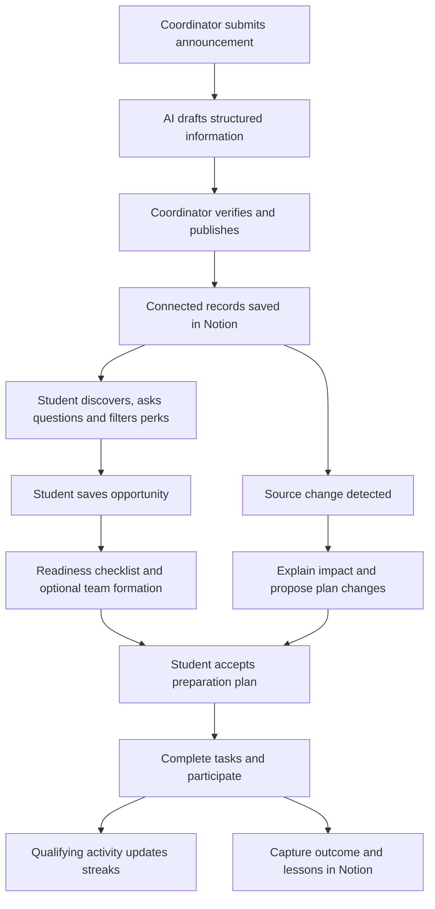

# CampusNext — Product Requirements Document

**Version:** 1.0  
**Date:** 2 October 2026  
**Status:** Proposed product specification; implementation has not started  
**Challenge:** KBC-NOTION-01 — Intelligent Campus Operating System  
**Product promise:** Turn campus information into a relevant opportunity, an achievable plan and a completed experience.

## 1. Product overview

CampusNext is a campus companion that connects relevant updates, opportunity preparation and team formation. Students discover what matters, understand published requirements, find willing collaborators and manage their next actions. Coordinators publish verified information and monitor follow-through.

The product combines three capabilities into one journey:

**Announcement → personal relevance → readiness checklist → accepted team → preparation tasks → participation → outcome.**

Notion is the active operational knowledge layer. A responsive student web interface connects to real Notion records through a backend that handles extraction, authorized search, recommendation explanations, dependency analysis and streak calculation. Coordinators can manage operational information directly in Notion.

Two confirmed additions are part of the first release: **Campus Streaks**, including personal and buddy streaks, and **Event Perks**, showing food and goodies with conditions and verification.

## 2. Problem and intended value

Campus information is distributed across announcements, posters, forms and documents. Students often discover an opportunity without knowing whether it applies to them, what preparation it requires or whom they can collaborate with. Changes can leave saved plans and preparation tasks outdated.

Coordinators need to know which notices are verified, where participation is blocked and whether students have completed necessary preparation.

CampusNext should help students answer four questions:

1. What changed that matters to me?
2. Which opportunities can I prepare for with my interests and available time?
3. What am I missing, and who can collaborate with me?
4. What should I do next?

The intended value is better follow-through and less coordination effort. Adoption, willingness to pay and improved participation are hypotheses to validate through a pilot.

## 3. Users and access

| Role | Main jobs | Access |
| --- | --- | --- |
| Student | Discover, save, prepare, join teams, complete tasks, track streaks | Published campus records and their own or explicitly shared activity |
| Club/campus coordinator | Review imports, publish notices, maintain requirements and perks, confirm participation, inspect progress | Managed clubs/events and permitted aggregate analytics |
| Workspace administrator | Configure workspace mapping, roles and integrations; resolve sync errors | Institution configuration and authorized administration |

The prototype must demonstrate student and coordinator experiences. Administrator setup can be a minimal configuration screen. Mentor review is a later extension.

Students explicitly opt into teammate discovery and choose which skills and availability are visible. Buddy partners see daily participation status and pair streak information; private task contents remain subject to their original access rules.

Filtered Notion views are presentation tools. Authorization must also be enforced before application reads, writes, recommendations and AI retrieval. MVP students use the authenticated application; coordinators receive appropriately scoped Notion access. Sharing all student records in a broadly accessible Notion database is not an acceptable permission design.

## 4. Goals, measurement and scope

### Goals

- Demonstrate the full source-to-action workflow using live Notion records.
- Deliver useful, explainable discovery from authorized information.
- Turn saved opportunities into linked requirements, teams and preparation tasks.
- Make relevant changes visible without silently replacing personal plans.
- Encourage consistent contributions through understandable streak rules.
- Make food and goodies discoverable without implying unverified benefits.

### Pilot measurements

| Metric | Definition |
| --- | --- |
| Activation | Students who save an opportunity and accept at least one preparation task |
| Weekly action participation | Activated students completing a qualifying action during the week |
| Preparation completion | Completed accepted preparation tasks / accepted preparation tasks |
| Verified participation | Organizer-confirmed participation, measured separately from self-reports |
| Team formation | Accepted teams formed through an opportunity |
| Discovery usefulness | Explicit useful/not-useful feedback on suggestions |
| Information quality | Corrections to published extracted fields and unresolved unknown fields |
| Operational reliability | Sync success, latency, duplicate records and permission-test results |
| Retention | Activated students returning in later weeks; report personal and buddy streak activity separately |

Set commercial success targets after a baseline pilot. Technical release targets are specified in section 12.

### Release boundary

The first release supports one institution, one connected Notion workspace, student/coordinator roles and coordinator-submitted announcements. It includes the combined journey, personal and buddy streaks, weekly freezes, badges, food/goodies filters, analytics and a demonstrated Notion change flowing back to the application.

Later releases may add multiple institutions, more source connectors, calendar integrations, mentor workflows, cross-workspace coordination and advanced matching.

Payments, public social feeds, autonomous external form submission, private-chat scraping and admissions or recruitment decisions are outside this release.

## 5. Core user journeys

### A. Publish verified campus information

1. A coordinator pastes announcement text or uploads a poster image.
2. The system stores the source and creates an extraction draft.
3. The coordinator reviews dates, eligibility, requirements, registration URL and perks.
4. Missing or conflicting fields stay marked for review.
5. Approval creates or updates linked Notion announcement and opportunity records.

### B. Discover and prepare

1. A student supplies interests and optionally skills and available preparation time.
2. Discovery shows authorized opportunities with reasons for relevance.
3. Saving an opportunity creates a readiness checklist.
4. Published requirements become confirmed checklist facts; student prerequisites can be complete, missing or unknown.
5. The student reviews a proposed preparation plan and accepts tasks.
6. The daily dashboard shows deadlines, blockers and the next action.

### C. Form a team

1. A saved opportunity identifies a missing role or collaborator need.
2. The student sees opted-in collaborators with relevant declared skills and availability.
3. An invitation stays pending until accepted; declining creates no membership.
4. Accepted membership connects the team, opportunity, project and shared tasks in Notion.
5. Team members confirm task ownership or leave tasks visibly unassigned.

### D. Respond to a change

1. A coordinator changes an event deadline or requirement in Notion.
2. Synchronization detects the new source revision.
3. CampusNext identifies affected saves, checklist items, teams and tasks.
4. Students see what changed, the source and affected work.
5. Revised preparation dates and newly required tasks appear as proposals for review.
6. Completed work and manual edits remain preserved unless the owner explicitly changes them.

### E. Build streaks and inspect perks

1. The student filters events by food, goodies or both, and reads the conditions.
2. A qualifying contribution earns the day's personal credit.
3. If both accepted buddies earn credit on the shared day, the pair earns one buddy streak day.
4. The dashboard shows the credited action, streaks, badge progress and available freeze.
5. Participation and outcomes are recorded separately from streak credit.

## 6. Functional requirements and acceptance criteria

All requirements marked **P0** are required for the first release. **P1** requirements follow the first complete workflow.

| ID | Priority | Requirement | Acceptance criteria |
| --- | --- | --- | --- |
| FR-01 | P0 | Account and profile | An authenticated student can set interests, declared skills and availability. Teammate discoverability starts off and requires explicit opt-in. |
| FR-02 | P0 | Announcement ingestion | Support pasted text and a poster image. Store source content/reference, publisher, import time and extraction revision. Reimporting the same source updates one record. |
| FR-03 | P0 | Extraction review | Extract title, dates, organizer, venue, category, eligibility, registration link, prerequisites and published perks when present. Unknown fields are labeled; a coordinator approves publication. |
| FR-04 | P0 | Opportunity discovery | Show authorized published opportunities. Filter by category, date, club, team need, food, goodies and both perks. Expired registration and cancelled events are clearly labeled. |
| FR-05 | P0 | Personalized relevance | Explain matches using declared interests, offered skills, published requirements and recorded workload. Missing information prevents a definitive eligibility claim. |
| FR-06 | P0 | Readiness and planning | Saving creates one checklist and a proposed task plan. Each item links to its source requirement. Tasks contain owner/unassigned state, deadline, status and dependencies. Acceptance is required before assigning proposed work. |
| FR-07 | P0 | Authorized natural-language discovery | Answer questions about opportunities, changes and preparation using authorized records. Each factual answer includes source links and update time. Insufficient evidence produces an explicit unknown rather than an invented answer. |
| FR-08 | P0 | TeamBridge | Suggest only opted-in people. Membership requires accepted invitation. Invitations and checklist generation are idempotent. Withdrawal removes future discoverability. |
| FR-09 | P0 | Daily action dashboard | Show accepted tasks, deadlines, invitations, relevant changes and streak status. Display why an item needs attention and its source or linked record. |
| FR-10 | P0 | Dependency and change impact | A verified deadline/requirement change identifies affected plans and explains the connection. Revised task dates are proposals; completed work and personal edits survive synchronization. |
| FR-11 | P0 | Campus Streaks | Implement the personal, buddy, badge, freeze, duplicate-prevention and visibility rules in section 7. |
| FR-12 | P0 | Food and goodies | Implement independent verified perk states, conditions, source fields and combined filters in section 8. Unknown information does not pass availability filters. |
| FR-13 | P0 | Notion synchronization | Create/update real linked records, detect an operational edit made directly in Notion and surface sync status. Retry without duplicating records or overwriting conflicting edits. |
| FR-14 | P0 | Notifications | In-app notices for accepted invitations, changed deadlines/requirements and upcoming accepted tasks. Users control optional reminders. One change produces one logical notification. |
| FR-15 | P0 | Outcomes and analytics | Record participation, submission/evidence, verification state and optional lessons. Coordinator metrics distinguish saved, self-reported registered, confirmed registered and confirmed attended. |
| FR-16 | P1 | Expanded delivery and reporting | Add optional email/push delivery, calendar export, mentor review and configurable report drafts after core acceptance criteria pass. |

## 7. Campus Streaks specification

### Qualifying activity

A qualifying action is completion of a designated preparation task, acceptance of a project milestone/contribution, or coordinator-confirmed attendance. Each must reference a real task, milestone or event. A task requiring approval earns credit only after acceptance; ordinary task completions use the task's declared evidence requirements. Qualifying status is configured by the coordinator/team lead, not earned by inventing unlimited personal tasks.

Login, browsing, saving an opportunity and repeatedly toggling a completed task do not qualify. The first accepted completion of a logical task can count once; reopening and completing it again creates no new credit. Distinct planned milestones can qualify independently, with the daily cap below.

### Personal streak rules

- At most one credit per student per calendar day, regardless of activity volume.
- MVP day/week boundaries use the configured campus timezone, default **Asia/Kolkata** for the pilot. Store timestamps in UTC and show the timezone in settings. Individual timezones can be added later.
- The first qualifying day starts a streak of one. Further consecutive qualifying days increase it by one.
- One freeze is available per Monday–Sunday campus week, refreshed Monday at 00:00, with no carry-over.
- At day close, an existing streak automatically uses an available freeze for a missed day. A frozen day preserves continuity and the count; it does not increment the count or earn a badge.
- An unprotected missed day breaks the current streak. The next qualifying day starts at one. Longest historical streak remains recorded.
- Badges unlock after 3, 7, 14 and 30 credited days in the current streak. Frozen days do not contribute.
- Defaults are private. Students can opt into sharing streak status. Show current streak, longest streak, remaining freeze, today's credited action and whether a date was frozen.

### Buddy streak rules

- A buddy relationship requires mutual acceptance. MVP supports one active buddy per student.
- Both students must earn a qualifying action on the same campus day to increase the pair count by one. Their actions may belong to different authorized projects.
- A missed buddy day can be protected only if each nonparticipating buddy has their own available freeze. Each missing student's freeze is consumed once for that date and also protects their personal streak where applicable.
- If protected, the pair count pauses for that date. If any missing buddy lacks a freeze, the buddy streak breaks.
- Ending the buddy relationship ends the active pair streak and preserves historical and personal records. A new buddy pair starts a new streak.
- Buddy visibility reveals participation status, not the contents of a private task.

### Integrity and delayed updates

Use unique activity identifiers and one student/day credit. Day closing and freeze consumption must be idempotent. Credit uses the recorded occurrence time; delayed approval or synchronization recalculates the original day and freeze history. Arbitrary student backdating is disabled. Corrections require an authorized audit entry and deterministic replay.

Required examples: multiple actions in one day increase by one; repeating completion earns no extra credit; one frozen day preserves the count; a second missed day in the same week breaks it; one active buddy alone earns no pair increment; both active buddies earn exactly one; delayed acceptance updates the original day without duplication.

## 8. Event Perks: food and goodies

Food and goodies are separate fields on each event/opportunity. Students can select either filter or both; both uses **AND**, so an event must satisfy both conditions.

| Field | Values/details |
| --- | --- |
| Food status | Provided / Not provided / Not announced |
| Food details | Meal, snack or refreshment description; included/paid/not stated; dietary options only when published |
| Goodies status | Provided / Not provided / Not announced |
| Goodies details | Kit, merchandise or giveaway description; included/paid/not stated; item list where known |
| Benefit type | Included benefit / Conditional benefit / Competition prize |
| Conditions | Registration, attendance, ticket tier, first-N allocation, collection time/location or other published conditions |
| Availability | Available / Exhausted / Withdrawn / Unknown |
| Verification | Needs review / Verified / Needs re-verification; source, verified by, verified at and updated at |

Organizer-verified **Provided** perks can pass the relevant availability filter when available or when stock availability is unknown. Unknown stock must be labeled, and conditions remain visible. Exhausted/withdrawn perks do not pass. Competition prizes are shown separately and do not count as guaranteed goodies in this filter.

“Not announced” is different from “Not provided.” Neither passes a provided-perk filter. Extracted but unverified perks stay in draft/review. A contradictory source edit triggers re-verification and temporarily removes the perk from verified availability results.

A perk may be paid or conditional; its card must disclose that fact. A first-100 claim must display that condition. Remaining-stock counts require an actual organizer-maintained count; the system does not infer them from page views or saved events. Streaks do not affect perk eligibility unless a coordinator publishes an explicit rule for that event.

Example: **Lunch included · Welcome kit for first 100 registrants · Stock not confirmed · Verified by organizer · Source link.**

## 9. Information model and Notion workspace

Each domain record has an application ID, Notion page ID, institution ID, visibility scope, source/version, update timestamp and sync status where applicable. Sensitive/private records must live in appropriately scoped pages/data sources; shared views alone do not establish access.

| Notion collection | Key fields and relations |
| --- | --- |
| Announcements | Publisher, source text/image/link, extracted draft, verification, revision; related opportunities |
| Opportunities & Events | Title, category, dates, venue, eligibility, registration URL, requirements, published status, perk fields; club, announcement |
| Clubs | Name, coordinators, description; events, people, projects |
| People | Display name, role, interests, declared skills, availability, discovery consent; club and team membership |
| Teams & Projects | Opportunity, accepted members, milestones, status; tasks and outcomes |
| Readiness & Saves | Student/opportunity, source requirement, complete/missing/unknown, saved/active/withdrawn/completed; related tasks |
| Tasks | Owner, team/student, deadline, status, prerequisite relations, source requirement, qualifying flag, evidence/approval state |
| Activity Log | Student, action, related record, occurrence/acceptance timestamps, credit eligibility, verification status, unique logical activity ID |
| Streaks & Buddies | Student/pair IDs, acceptance, current/longest count, daily-credit ledger references, weekly freezes, visibility |
| Participation & Outcomes | Student/team/opportunity, registration/attendance state, evidence, verified by, deliverable and lessons |
| Changes & Decisions | Source revision, affected records, explanation, proposal, approval/rejection and audit details |

Source media and citations are retained so extracted facts can be inspected. Application authentication identifiers, integration credentials, authorization rules, retry queues and search-index internals belong in the service layer. Student Notion accounts are optional for application use; coordinator setup requires access to the connected workspace.

## 10. Meaningful Notion integration and sync contract

Notion is authoritative for approved campus information, operational tasks and shared documentation. The backend maintains a derived authorized search/cache layer and operational ledgers, and mirrors approved domain activity and summaries into Notion. Operational changes made in Notion must affect the student workflow.

Current Notion APIs distinguish databases, data sources and pages. Store actual IDs, use the selected current API version and implement pagination; sharing only a page containing a linked view does not grant access to the source database. [Notion database documentation](https://developers.notion.com/guides/data-apis/working-with-databases).

Minimum demonstrated writes are: publish an opportunity, create related preparation tasks, persist accepted team membership, record activity, update a streak summary and save an outcome. Minimum demonstrated inbound edit is a changed deadline or perk condition from Notion.

Sync behavior:

- Every mutation has an operation ID and stable domain identity. Retried imports, invitations and task generation remain idempotent.
- Show Pending, Synced, Failed or Conflict plus last successful synchronization time. A locally accepted action can be pending; it must not be presented as saved in Notion until acknowledged.
- MVP may use bounded polling; webhooks can supplement it. Queue requests, paginate reads and reconcile periodically.
- Compare source revisions before writing. Campus source fields use coordinator-approved source truth; personal task ownership, progress and manual dates require conflict review before replacement.
- Changed/deleted sources invalidate derived search content and affected plans. Cancelled events retain history and notify interested authorized students.
- Handle throttling using the returned Retry-After header and bounded retries. Inspect uncertain write outcomes before repeating a create. [Notion request limits](https://developers.notion.com/reference/request-limits).

The core workflow uses the API service and does not depend on purchasing native database automations. Native automations are optional conveniences; general database automations require paid plans and cannot trigger one another. [Notion automation documentation](https://www.notion.com/help/database-automations).

## 11. AI, permissions and product trust

- AI produces extraction drafts, relevance explanations, source-grounded answers and proposed preparation plans.
- Store verified facts separately from generated suggestions. Each extracted requirement or perk retains its source and approval state.
- A missing date, eligibility field or benefit stays unknown. Coordinator review resolves conflicting announcements.
- Recommendations explain declared interests/skills and recorded requirements; they do not claim inferred personality, guaranteed eligibility or admission/selection.
- Apply institution and record-level access before retrieval, prompt construction, answer generation and write operations. The integration's broad technical access does not automatically authorize a student to view every record.
- Respect opt-in discovery, membership withdrawal and source access revocation. Remove restricted records from derived discovery/search when access changes.
- Uploaded content is data to analyze; embedded instructions cannot authorize unrelated actions or override permissions.
- AI cannot automatically submit external registrations, accept invitations for students or allocate task ownership without the required user action.
- Coordinator analytics show permitted aggregates and managed event records. Private student activity and unrelated project details remain scoped.

## 12. Experience and non-functional requirements

Primary screens: student Today, opportunity discovery, opportunity detail/readiness/perks, team/project page, Ask CampusNext, personal/buddy streak view, coordinator review/dashboard and admin connection health.

The student experience must work at a 360 px mobile width and on desktop. Key flows must support keyboard interaction, descriptive labels and readable contrast. Verification, perk and streak states must be understandable through text as well as icons/colors. A student can dismiss optional reminders, withdraw a team-discovery profile and control streak visibility.

Proposed prototype release targets, measured on the demo dataset:

- Cached dashboards and filter results: p95 under 2 seconds under normal connectivity.
- Extraction and AI answers: progress shown promptly; p95 under 20 seconds, with retry/error feedback.
- Operational Notion changes: visible within 60 seconds under normal connectivity at demo scale. Degraded sync is clearly labeled.
- Permission isolation: zero unauthorized record disclosures in the required role/record tests.
- Duplicate safety: zero duplicate logical opportunities, tasks, membership or streak credit in replay tests.
- Server-side secrets; no credentials in browser bundles or user-facing logs.
- Audit trace for publication, verification, membership, task-date approval, perk changes and streak correction.

These are engineering targets, not existing measured performance or production service guarantees. Load-test larger pilots before promising institution-wide capacity. Model usage and API traffic must be metered so a pilot's operating cost is visible.

## 13. Prototype dataset and end-to-end acceptance

Use clearly labeled synthetic data: 20 students, 3 clubs, 8 opportunities/events, 4 teams and 30 preparation tasks. Include technical, cultural, sports and volunteering opportunities. Include food only, goodies only, both, neither, unannounced, paid, first-N and prize-only examples. Seed historical activity transparently to demonstrate streaks.

| Test | Required result |
| --- | --- |
| Import a poster twice | One sourced announcement/opportunity; missing fields remain unknown |
| Publish after review | Real Notion records and relations appear; authorized discovery sees the approved version |
| Save and prepare | One readiness checklist; accepted tasks have ownership/deadlines/dependencies |
| Search with a source-backed question | Relevant answer with source; no private record leakage |
| Invite a teammate | No membership before acceptance; accepted team links to opportunity/tasks |
| Edit a deadline directly in Notion | Change notice and affected records appear; revised personal dates await approval |
| Complete a qualifying task repeatedly | Exactly one logical activity and at most one daily personal credit |
| Both buddies contribute | Exactly one pair increment; private task details stay private |
| Miss a day, then two in one week | One freeze preserves count; the unprotected day breaks the streak |
| Apply food + goodies filters | AND behavior; unknown/unverified and prize-only benefits do not qualify |
| Withdraw a previously confirmed perk | Verified filters update; saved users see the change |
| Simulate a sync error/retry | Visible error/pending state; successful recovery without duplicate writes |
| Record an outcome | Self-report and organizer verification remain distinguishable; linked Notion outcome exists |

Final demonstration: import → verify → discover → save → identify missing teammate → accept invitation → accept tasks → complete action → show personal/buddy streak → filter verified perks → edit source deadline in Notion → review revised plan → capture outcome.

Release requires all P0 criteria, the above scenarios and live Notion read/write proof. Deliver a source repository, demo workspace/dataset, architecture/data-flow documentation and pitch.

## 14. Implementation sequence and commercial validation

1. Establish the schema, role authorization, workspace mapping and reliable Notion read/write loop.
2. Complete import/review, opportunity discovery and sourced questions.
3. Add saves, readiness, accepted tasks, team invitations and change impact.
4. Add event perks, activity recording, personal/buddy streaks, freezes and badges.
5. Add coordinator analytics, outcomes, notification controls and complete the demo/error cases.

Pilot first with one department and willing clubs. Observe whether students repeatedly act on information and whether coordinators spend less effort answering repeated questions. Interview student-affairs/department buyers about a proposed institution subscription; student access is intended to be free. Pricing and willingness to pay remain unvalidated.

Expansion should follow evidence of useful repeated coordination. Additional institutions and source integrations come before broad consumer expansion.

## 15. Traceability to Track 1

| Challenge requirement | CampusNext implementation |
| --- | --- |
| Information structuring | Text/poster ingestion, extraction drafts and coordinator verification |
| Active Notion knowledge layer | Live linked records, real writes and inbound operational edits |
| Context-aware discovery | Authorized source-grounded questions and explainable relevance |
| Personalized workflow | Saved opportunities, readiness, accepted preparation tasks and reminders |
| Relationships and dependencies | Announcement → opportunity → student/team → project → task → outcome |
| At least two roles | Student and coordinator experiences with enforced access |
| Analytics | Preparation, registration/participation, blockers, activity and sync metrics |

The challenge requires meaningful integration and a working web/mobile prototype; a static template or link is insufficient. [Original challenge brief](https://docs.google.com/document/d/1VLd7FzdjjwXsE0O3qBzSA9s6kiewNgbSm4XJ2g3WRgU/edit?tab=t.0).

## 16. Decisions to confirm during implementation

The PRD uses explicit defaults so development can start: one campus workspace, campus timezone, one buddy pair per student, weekly automatic freezes, coordinator-approved source facts and API-driven core workflows.

Before a real pilot, confirm workspace owner/access scopes, institution sign-in, available Notion plan/capacity, permitted source material, data-retention policy, notification channels, chosen AI/runtime services and operating-cost budget. These are setup decisions, not requests to expand the agreed product scope.

## 17. System flow

The detailed coordinator, student, synchronization, streak and perk flows are defined in [CampusNext System Flow](<C:/Users/ranuk/Documents/PIXEL PIONEEERS/CampusNext_System_Flow.md>).

**Pitch:** CampusNext turns campus announcements into achievable experiences—helping students discover what matters, find their people and take the next step.
