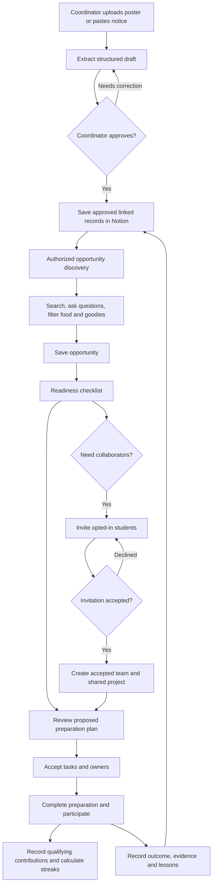
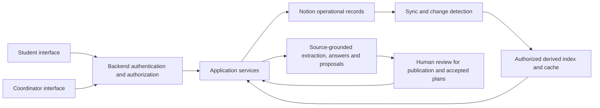
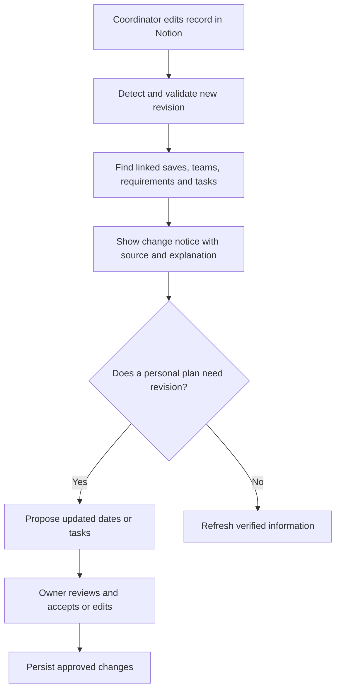

# CampusNext — System Flow

**Date:** 2 October 2026  
**Companion specification:** [CampusNext PRD v1.0](<C:/Users/ranuk/Documents/PIXEL PIONEEERS/CampusNext_PRD.md>)  
**Status:** Proposed implementation flow

## 1. Main lifecycle

**Publish → discover → save → prepare → collaborate when needed → participate → capture outcome.**

Streaks reward qualifying progress during this journey. Food and goodies help students discover events with published benefits. Changes in Notion update the relevant student workflow throughout the lifecycle.

Team formation is optional for individual opportunities. Useful individual preparation can continue while invitations are pending. Source content remains linked to the opportunity; outcome records are additional records, not replacements for the original announcement.

## 2. Coordinator flow

| Step | Screen/action | System response |
| --- | --- | --- |
| 1 | Sign in as coordinator | Confirm institution, managed clubs/events and authorized records |
| 2 | Submit announcement text or poster | Store source, detect duplicates and create extraction job |
| 3 | Review extracted information | Show title, dates, venue, requirements, registration URL, food/goodies and unresolved fields |
| 4 | Correct and approve | Validate required fields; publish confirmed information; leave optional unknown fields labeled |
| 5 | Open linked Notion records | Show saved announcement, opportunity and related club; surface pending/failed sync if needed |
| 6 | Monitor dashboard | Show preparation progress, accepted teams, registration/participation states and blockers |
| 7 | Update deadline, requirement or perk | Record revision, identify affected plans and notify authorized interested students |
| 8 | Confirm attendance/outcome | Keep organizer-confirmed evidence separate from self-reports and capture lessons |

Publishing a notice does not automatically register students, create accepted teams or assign them work.

## 3. Student screen flow

**Sign in → profile → Today → Discover → Opportunity detail → readiness → optional team → accepted plan → tasks → participation → outcome.**

1. **Profile:** Set interests, optional declared skills and availability. Choose whether to be discoverable to collaborators.
2. **Today:** See relevant updates, accepted tasks, deadlines, invitations, changes and personal/buddy streaks.
3. **Discover:** Search opportunities and filter by category, date, club, food, goodies or both. Ask source-grounded campus questions.
4. **Opportunity detail:** Read verified facts, source, requirements, registration link and perk conditions. Save the opportunity.
5. **Readiness:** See complete, missing and unknown prerequisites. Provide missing information or select a next action.
6. **TeamBridge, when needed:** Review opted-in collaborators, send invitations and create membership only after acceptance. Accepted members confirm task ownership.
7. **Preparation plan:** Review suggested tasks and dates; accept or edit them. Save the accepted plan and dependencies into linked Notion records.
8. **Tasks:** Complete work and attach evidence where required. Blocked tasks explain the unmet prerequisite. Qualifying accepted contributions feed the streak calculation.
9. **Registration/participation:** Open the organizer's registration link and track submission. External submission is student-reported until a coordinator or integrated registration source confirms it.
10. **Outcome:** Record deliverable, participation evidence and optional lessons. Show verification state explicitly.

The student can return from any stage to Today. Saving, withdrawing or abandoning an opportunity does not imply participation.

## 4. Data and Notion flow

- **Notion holds:** Approved campus records, relationships, tasks, shared documentation, activity summaries and outcomes.
- **The backend handles:** Identity, authorization, extraction, recommendations, dependency analysis, streak ledgers, queues and synchronization.
- **Derived data:** Search/cache content is rebuilt from authorized operational records and invalidated when access or source content changes.
- **Writes:** Display Pending until Notion acknowledges a write; errors remain visible and retry uses the same operation identity.
- **Reads:** Retrieve only records the requesting role is authorized to use. AI answers cannot expand access.

Example relationship: **Announcement → Event → Saved opportunity → Team → Preparation task → Activity → Outcome.** Each activity also relates to its student and applicable streak.

## 5. Change and failure flow

Published source facts refresh from the approved revision. Personal task changes remain proposals. Completed work and manual edits are preserved. A conflicting source marks affected facts for review rather than presenting an unsupported answer.

Import failure returns an editable source/draft and retry option. Sync failure keeps pending work visible, retries safely and avoids duplicate records. Access revocation removes affected content from subsequent discovery and AI retrieval. Event cancellation retains history and makes its status visible to interested students.

## 6. Streak flow

**Contribution → validate qualifying action → prevent duplicate credit → assign campus date → update personal credit → evaluate accepted buddy pair → mirror summary to Notion.**

| Condition | Result |
| --- | --- |
| First valid contribution today | Earn one personal day credit |
| Additional contribution or repeated task toggle | No additional daily credit |
| Both buddies earn credit on the same campus date | Increase pair count once |
| Only one buddy earns credit | Pair awaits the end-of-day protection check |
| A missed day with an available weekly freeze | Preserve existing streak without incrementing it |
| An unprotected missed day | Break current streak; preserve longest historical streak |
| Buddy pair has a missed day | Each missing participant must have their own freeze; otherwise the pair breaks |
| Delayed approval/sync | Recalculate original recorded date and freeze history without duplication |

Campus timezone defaults to Asia/Kolkata. The weekly freeze refreshes Monday 00:00, does not accumulate and is consumed once per student/date. A single freeze can protect the student's personal and buddy continuity for that date. Badges use credited days, excluding frozen days. Buddy contribution status is visible according to consent; private task contents retain their own access rules.

## 7. Food and goodies flow

**Published perk details → coordinator verification → structured event fields in Notion → filterable event cards → condition/availability updates.**

Food and goodies each use Provided, Not provided or Not announced, with a separate verification state. Cards show included/paid/not stated, description, eligibility, allocation limits, source and update time.

- Food only: include organizer-verified provided food; disclose any cost/conditions.
- Goodies only: include organizer-verified provided benefits; prize-only possibilities are separate.
- Both: require both conditions using AND.
- Not announced/unverified: do not pass the relevant availability filter.
- Exhausted/withdrawn: remove the perk from availability results.
- Stock unknown: a verified offer may appear, but the card explicitly says stock is unconfirmed and shows first-N conditions where applicable.

Streaks and perks are independent unless an event publishes an explicit eligibility rule.

## 8. Concrete demonstration

A coordinator imports a hackathon poster with an abstract deadline, lunch and limited welcome kits. After verification, a student discovers it using the Food + Goodies filter, saves it, identifies a missing teammate, forms an accepted team and accepts preparation tasks. The student completes a qualifying task and sees personal credit; the buddy contributes and the pair count updates. The coordinator then edits the deadline in Notion. The system explains which tasks are affected and proposes a revised plan. Finally, participation is confirmed and a linked outcome record is saved.

This demonstrates the complete flow with live Notion records, source-backed information, collaborative actions, streaks, event perks and change impact.
