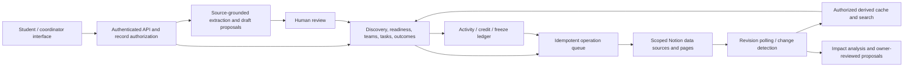

# CampusNext — interactive system design

A responsive, runnable design prototype based on `CampusNext_PRD.md`, `CampusNext_System_Flow.md`, and `CampusNext_UIUX.md`. The existing HTML, styles, sample records, and domain helpers are completed by the application in `app.js`.

## Run

From this directory:

```powershell
node server.js
```

Open http://127.0.0.1:4173. No package installation is required. To run the domain checks:

```powershell
node --test domain.test.js
```

## Deploy to GitHub Pages

The repository includes a GitHub Actions workflow that publishes the static CampusNext interface when changes are pushed to `main` or `master`, or when run manually. In the repository's **Settings → Pages**, set the build and deployment source to **GitHub Actions**. The workflow publishes only the browser app files; it does not publish `.env.local`, the Node server, or the Notion adapter.

GitHub Pages does not run the Node server, so Notion sync and other `/api/notion/*` endpoints will remain unavailable on the Pages deployment. Keep using `node server.js` locally for the server-backed prototype, or deploy the server separately to enable those endpoints. Never put a Notion API key in browser code or GitHub Pages.

## Connect Notion

The server now includes a credential-safe Notion adapter. It uses the official REST API from the server, never exposes the token to the browser, and provides `/api/notion/status`, `/api/notion/opportunities`, and `POST /api/notion/opportunities`.

1. Create an internal Notion integration and copy its secret.
2. Share the **Opportunities & Events** data source with that integration. The integration needs read content to sync and insert/update content if you want publishing writes.
3. Copy the data-source ID and create `campusnext/.env.local` from [.env.example](C:/Users/ranuk/Documents/PIXEL%20PIONEEERS/campusnext/.env.example):

```text
NOTION_API_KEY=your_server_side_secret
NOTION_OPPORTUNITIES_DATA_SOURCE_ID=your_data_source_id
NOTION_VERSION=2026-03-11
```

4. Restart `node server.js`, then open Coordinator → Settings → Connection health. The status endpoint validates the token and data-source access. Use Sync opportunities from Notion to load authorized records into the interface.

The adapter recognizes common property names such as Title/Name, Event date, Deadline, Organizer, Category, Eligibility, Requirements, Food status/details, Goodies status/details, Venue and Source. Keep the token in `.env.local`; that file is intentionally excluded from the browser bundle and should not be committed.

The prototype uses a fixed demonstration date of **3 October 2026**. All people, source records, events and historical progress are synthetic. Edits persist in this browser's local storage. Profile → Reset demo restores the sample dataset.

## Designed experiences

| Specification | Implemented experience |
| --- | --- |
| S02 Today | Personal greeting, featured discovery, streak summary, accepted tasks, source-change notice and calendar |
| S03 Explore | Search, category, saved view, independent food/goodies filters with AND behavior, event cards and conditions |
| S04/S05 Opportunity and readiness | Eligibility, source inspection, three-state self-reported checklist, suggested/accepted plans and editable dates |
| S06 Tasks | Upcoming, blocked and completed states; dependency checks; evidence submission and approval |
| S07 Teams | Opted-in sample collaborators, pending invitations, explicit acceptance/decline and membership withdrawal |
| S08 Streaks | Daily-credit ledger, weekly freezes, current/longest counts, badges and a sample buddy interaction |
| S09 Ask | Deterministic lookup of sample tasks, perks and changes, with links to source records and explicit unknown answers |
| S10 Changes | Previous/updated source deadline, impact explanation, reviewed task dates and keep-my-plan action |
| S11 Profile | Interests, skills, availability, discovery/streak privacy preferences, role switch and reset |
| S12 Outcomes | Self-reported participation, evidence and lessons; coordinator confirmation is separate |
| C01–C04 Coordinator | Overview, review queue, manual source review, local publication, deadline updates, participation and task approval |
| A01 Health | Explicit disconnected state and explanation of local persistence |

The light theme uses restrained teal, neutral surfaces, gentle sage/lavender/ochre artwork, reusable cards, semantic buttons and native dialogs. Desktop uses persistent left navigation; mobile uses bottom navigation. Illustrations are native SVG and the interface has no remote asset dependency. Reduced-motion preferences are supported.

## Demonstration sequence

1. Explore → enable Food and Goodies. Both conditions must hold; unknown stock remains disclosed.
2. Open Open Source Saturday → Save → Review suggested plan → Accept plan.
3. Tasks → complete an eligible task. Dependent work becomes available; repeated task completion does not earn additional credit.
4. Teams → accept Ishita's invitation. Outgoing invitations remain pending.
5. Today → Review change → accept reviewed dates or preserve the current plan.
6. On an opportunity, record an outcome with evidence.
7. Profile → Switch to coordinator → Participation → review evidence.
8. Coordinator → Import announcement → save an incomplete draft, reopen it, correct fields, verify the source and publish locally.

## Proposed production system



For implementation, use the PRD's domain entities and authorization boundaries. Each record needs a stable application ID, institution and visibility scope, source revision, Notion page ID and synchronization state. Saves are unique per student/opportunity; invitations per pair/opportunity; activity by logical contribution; daily credit by student/campus date. A queue operation retains its identity across retries. Verified source edits update campus facts immediately while personal task edits remain proposals.

## Honest implementation boundary

This deliverable is the **interactive design**, not the PRD's completed production P0 release. The browser role switch is a presentation control, not authorization. The local HTTP server serves static files only.

Still required for the live release: campus authentication and backend access checks; real scoped Notion reads/writes and revisions; reliable queues/retries/conflict handling; source OCR and AI extraction; production grounded retrieval; the full prescribed dataset; real multi-user invitations; deterministic shared buddy/freeze replay; live time/day-close jobs; reminder delivery and expanded discovery filters. Poster upload is not simulated as successful OCR. Publication and persistence never claim successful Notion synchronization.

The sample buddy count is seeded separately, with a clearly labeled simulation for today's contribution. It does not implement the PRD's complete historical pair replay. The profile starts with sample progress because it is explicitly a demo account; real onboarding must start empty.

## Verification

Five Node tests cover verified perk filtering, rejection of exhausted/withdrawn/prize-only benefits, task credit deduplication and daily cap, weekly freeze behavior, delayed-credit recalculation, plan idempotency and task dependencies. Browser checks cover discovery filters, save/plan acceptance, task completion, accepted membership and draft preservation. Mobile was inspected at a 360-pixel viewport for horizontal overflow. These are prototype checks, not a claim of complete WCAG conformance or production authorization testing.
