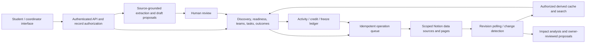

# CampusNext — interactive system design

A responsive, runnable design prototype based on `CampusNext_PRD.md`, `CampusNext_System_Flow.md`, and `CampusNext_UIUX.md`. The existing HTML, styles, sample records, and domain helpers are completed by the application in `app.js`.

## Run

From this directory:

```powershell
node server.js
```

Open http://127.0.0.1:4173. No package installation is required. To run the domain checks:

```powershell
npm test
```

## Deploy to GitHub Pages

The repository includes a GitHub Actions workflow that publishes the static CampusNext interface when changes are pushed to `main` or `master`, or when run manually. In the repository's **Settings → Pages**, set the build and deployment source to **GitHub Actions**. The workflow publishes only the browser app files; it does not publish `.env.local`, the Node server, or the Notion adapter.

GitHub Pages does not run the Node server, so Notion sync and other `/api/notion/*` endpoints will remain unavailable on the Pages deployment. Keep using `node server.js` locally for the server-backed prototype, or deploy the server separately to enable those endpoints. Never put a Notion API key in browser code or GitHub Pages.

## Connect Notion

CampusNext uses a server-side Notion connection for opportunities and events. The API token stays in the ignored `.env.local` file. The Notion plugin in Codex and this application connection are separate.

The connected workspace page is [CampusNext](https://www.notion.so/3ed0267559c7808b9282c73280f3bef7). Its [Opportunities & Events database](https://app.notion.com/p/2518d85ee14b4716ab272abe6d559605) has been created and configured locally. No example events are automatically published to it.

### Use it

1. Run `npm start` and open http://127.0.0.1:4173.
2. In Coordinator → Settings, check the connection and use **Sync opportunities from Notion**. The app also syncs on load and every 60 seconds while the tab is visible and you are not editing a form or dialog.
3. In Coordinator → Opportunities, use **Publish to Notion** to copy an existing local opportunity, or **Import announcement** to review and publish a new one. Drafts and failed submissions are retained locally; a save is only reported after Notion acknowledges it.
4. Use **Open in Notion** to manage descriptions, dates, organizers, requirements and perk conditions. Check **Published** to include a record in student discovery. New Notion rows default to unpublished.
5. **Review / update** saves deadline changes to Notion. A changed deadline creates a review notice in CampusNext. Personal task dates change only after the student accepts them.

Sync retains local records and saved-plan references. Records removed from Notion leave discovery but keep their cached record for existing plans. Application IDs keep a repeated publish from creating another row within this local server. The server checks the last edited timestamp before deadline updates and reports a conflict for a stale record. Notion does not offer an atomic compare-and-set here, so a simultaneous edit between the check and write remains possible. Writes are serialized within one server process; distributed queues are not implemented.

### Set up another workspace

Copy [.env.example](.env.example) to `.env.local` and set `NOTION_API_KEY`. Create a Notion internal connection with read, insert and update content capabilities. Share the intended parent page with it using **••• → Connections**. See [Notion authorization](https://developers.notion.com/guides/get-started/authorization).

Run:

```powershell
npm run notion:setup -- --parent "YOUR_SHARED_NOTION_PAGE_URL"
npm run notion:check
npm start
```

The setup script creates an **Opportunities & Events** database with the schema in `notion-schema.js`, or reuses a matching child database. It stores its data-source ID and the parent ID in `.env.local` while preserving the token. Re-running setup does not seed data. Restart the server after changing settings. Alternatively set a known `NOTION_OPPORTUNITIES_DATA_SOURCE_ID` directly. API version defaults to `2026-03-11` and can be overridden with `NOTION_VERSION`.

The local server only serves an explicit list of browser assets and rejects cross-origin writes. It is bound to 127.0.0.1 and remains a trusted single-user prototype, without campus authentication. Use a dedicated data source containing shareable campus opportunities. Tasks, teams, outcomes and student profiles still live in browser storage.

The prototype uses a fixed demonstration date of **3 October 2026**. Its bundled people, events and historical progress are synthetic. Profile → Reset demo restores that local dataset; it does not remove Notion records.

## Designed experiences

| Specification | Implemented experience |
| --- | --- |
| S02 Today | Personal greeting, featured discovery, streak summary, accepted tasks, source-change notice and calendar |
| S03 Explore | Search, category, saved view, independent food/goodies filters with AND behavior, event cards and conditions |
| S04/S05 Opportunity and readiness | Eligibility, source inspection, three-state self-reported checklist, suggested/accepted plans and editable dates |
| S06 Tasks | Upcoming, blocked and completed states; dependency checks; evidence submission and approval |
| S07 Teams | Opted-in sample collaborators, pending invitations, explicit acceptance/decline and membership withdrawal |
| S08 Streaks | Daily-credit ledger, weekly freezes, current/longest counts, badges and a sample buddy interaction |
| S09 Ask | Deterministic lookup of sample tasks, perks and changes, with links to source records and explicit unknown answers |
| S10 Changes | Previous/updated source deadline, impact explanation, reviewed task dates and keep-my-plan action |
| S11 Profile | Interests, skills, availability, discovery/streak privacy preferences, role switch and reset |
| S12 Outcomes | Self-reported participation, evidence and lessons; coordinator confirmation is separate |
| C01–C04 Coordinator | Overview, review queue, manual source review, local publication, deadline updates, participation and task approval |
| A01 Health | Explicit disconnected state and explanation of local persistence |

The light theme uses restrained teal, neutral surfaces, gentle sage/lavender/ochre artwork, reusable cards, semantic buttons and native dialogs. Desktop uses persistent left navigation; mobile uses bottom navigation. Illustrations are native SVG and the interface has no remote asset dependency. Reduced-motion preferences are supported.

## Demonstration sequence

1. Explore → enable Food and Goodies. Both conditions must hold; unknown stock remains disclosed.
2. Open Open Source Saturday → Save → Review suggested plan → Accept plan.
3. Tasks → complete an eligible task. Dependent work becomes available; repeated task completion does not earn additional credit.
4. Teams → accept Ishita's invitation. Outgoing invitations remain pending.
5. Today → Review change → accept reviewed dates or preserve the current plan.
6. On an opportunity, record an outcome with evidence.
7. Profile → Switch to coordinator → Participation → review evidence.
8. Coordinator → Import announcement → save an incomplete draft, reopen it, correct fields, verify the source and publish locally.

## Proposed production system



For implementation, use the PRD's domain entities and authorization boundaries. Each record needs a stable application ID, institution and visibility scope, source revision, Notion page ID and synchronization state. Saves are unique per student/opportunity; invitations per pair/opportunity; activity by logical contribution; daily credit by student/campus date. A queue operation retains its identity across retries. Verified source edits update campus facts immediately while personal task edits remain proposals.

## Honest implementation boundary

This deliverable is the **interactive design**, not the PRD's completed production P0 release. The browser role switch is a presentation control, not authorization. The local HTTP server serves the browser app and the Notion opportunities API.

Still required for the live release: campus authentication and backend access checks; Notion persistence for tasks, teams, activity, streaks and outcomes; durable queues and distributed conflict handling; source OCR and AI extraction; production grounded retrieval; the full prescribed dataset; real multi-user invitations; deterministic shared buddy/freeze replay; live time/day-close jobs; reminder delivery and expanded discovery filters. Poster upload is not simulated as successful OCR. Opportunity publication and deadline updates are acknowledged by Notion; other domain actions remain local.

The sample buddy count is seeded separately, with a clearly labeled simulation for today's contribution. It does not implement the PRD's complete historical pair replay. The profile starts with sample progress because it is explicitly a demo account; real onboarding must start empty.

## Verification

Fourteen Node tests cover domain rules, configuration precedence, exact publication states, pagination, create deduplication, stale revision and data-source checks, non-destructive sync, throttling, and local HTTP boundaries. A live Notion check verified creation of an unpublished draft, retry deduplication, deadline update and readback; the temporary record was moved to trash afterwards. These checks do not establish production authentication or multi-user authorization.
